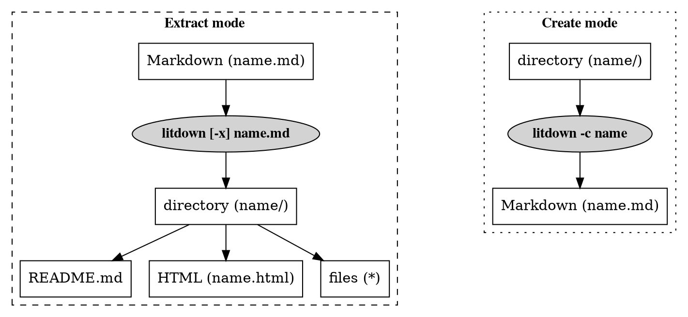

# Purpose

Litdown is a literate programming tool that processes Markdown input into both
documentation formats and extracts files embedded in the Markdown.
Litdown can also be used to convert an existing project into Markdown source.
Litdown is completely agnostic regarding programming languages, file formats,
build systems, and version control systems.


# Features

## Bidirectional operation

Litdown operates in either extract or create mode.
Extract mode converts literate Markdown source into generated documentation and
files.
Create mode is effectively the opposite of extract mode (although the round
trip is lossy) and is intended to assist converting an existing project into
literate Markdown source.

## Multiple Markdown processing modules

Litdown currently supports using the [Commonmark][commonmark-npm],
[Markdown-it][markdown-it-npm], and [Marked][marked-npm] NPM modules to process
literate Markdown source.
Litdown does not intend to perform this step itself and this alows the user to
determine which Markdown backend to use.

Litdown tries to be smart about which backend to use by checking available
backend plugins, installed modules, the user's list of preferred backends, and
a default list of preferred backends to determine which to use.
The `-b` and `-B` options can be used to modify and/or view this process.
See the [Usage](#usage) section for details.

Supporting a new or different backend module is as simple as creating a plugin.
For details, see the [Backend plugins](#backend-plugins) section.

## Non-executing

Litdown only creates files inside a previously non-existing directory under the
current working directory.
It never executes any embedded Javascript or system commands found in the
literate Markdown source.
This eliminates a bunch of potential security problems and places the
responsibility and trust where it should be: between the developer and the
user.
If additional processing or compiling steps are required in your project, you
should develop it in the form of a Makefile, script, or use a build system to
perform it.

Litdown uses a [Makefile](#makefile) to perform processing within its own
source directory and a [build script](#bin/build.sh) to perform steps that the
Makefile cannot.

## Self-hosting

Litdown (re)builds itself from the [litdown.md](../litdown.md) file via the
[build script](#bin/build.sh).

## Table of contents

Litdown generates anchored headers and a linked table of contents from the
headers in the literate Markdown source.
The TOC is prepended to the source to create the README.md file, which is used
to create the other documentation formats.
Each header must be _unique_ in order for the links to work properly.
Anchor names are normalized versions of the headers and are inserted into the
HTML.
Authors may also leverage anchored headers to create cross-references in the
form of [internal links](#internal-links).

## Templating

Litdown encourages the use of templates, which allow for content to be defined
in one place and be embedded in multiple files or in multiple places in a file.
See the [template](#templates) and [template label](#template-labels) syntax
for more details.

# Syntax

Litdown source is Markdown with a few specific conventions that facilitate its
use as a literate programming tool.

## Templates

A template consists of a header with a unique name which also contains at least
one code block.

```markdown
# Template name

_"_backticks"
Contents
_"_backticks"
```

## Template labels

Templates are transcluded into one or more templates by the use of a template
label inside the destination template.
The following would transclude the "Template name" template into the "Template
labels" template.

```nohighlight
_"Template name"
```

### Notes about template labels

1. If a template with the name given in the template label is not defined in
   the document, the template label is left as-is.
2. Templates may contain successive template labels, but should never have a
   circular reference, as this would result in an infinite loop.

## Embedded files

Files are templates with an associated file directive.
The file directive is a special type of link with 2 requirements:

* Link target begins with '#'
* Link title begins with 'save:'

A file directive results in an [internal link](#internal-links) to the section
and directs Litdown to create the file under the given path with the contents
after resolving all [template labels](#template-labels).

Standard Markdown link syntax is:

```markdown
[text](href "title")
```

Litdown file directive syntax is:

```markdown
[text](#path/to/file.ext "save:mode")
```

If the mode is omitted, and the title is just `"save:"`, the default is 644
(`rw-r--r--`).

Although the 'text' field can be anything, a good default is to make it the
same as the 'href' field, except without the leading '#':

```markdown
[path/to/file.ext](#path/to/file.ext "save:mode")
```

## Internal links

Internal links are links to section headers in the same document.
Note that the 'href' field starts with a '#'.

```markdown
[text](#normalized-header-text "optional title")
```

# Installation

## Dependencies

Litdown depends on [Node.js][nodejs].

## NPM

The official way to install Litdown is with [NPM][].

[npm]: https://www.npmjs.com

```bash
npm install -g litdown
```

Be sure to also install at least one of the supported backend modules:

* [Commonmark][commonmark-npm]
* [Markdown-it][markdown-it-npm]
* [Marked][marked-npm]

## Git

```bash
git clone https://github.com/qtfk/litdown
```

## Archives

The following archive files are created automatically by the
[build script](#bin/build.sh).

* [litdown.tbz](../archives/litdown.tbz "Extract via 'tar xjf litdown.tbz'.")
* [litdown.tgz](../archives/litdown.tgz "Extract via 'tar xzf litdown.tgz'.")
* [litdown.zip](../archives/litdown.zip "Extract via 'unzip litdown.zip'.")

## Building

Building Litdown isn't strictly necessary since everything is already built in
the Git repository and the archives.
However, you are welcome to rebuild it yourself.
The build process uses a [build script](#bin/build.sh), which in turn uses the
embedded [Makefile](#makefile).
The files that are generated by this process are listed in the
[Resulting](#resulting) section.

### Build dependencies

* [UglifyJS][uglifyjs-npm]
* [Pandoc][]

### bin/build.sh

```bash
#!/bin/sh

set -eo pipefail # exit on first failed command
n=litdown
cd $(dirname $0)/..

echo Running Litdown against $n.md
bin/$n.js -l $n.md
echo

echo Processing $n/Makefile
make -C $n
echo

echo Rearranging files
mv $n/$n.html $n/doc/
mkdir $n/log
mv $n/$n.json $n/log/
echo

echo Creating archives
rm -rf archives
mkdir archives
tar cjf archives/$n.tbz $n
tar czf archives/$n.tgz $n
zip -qr archives/$n.zip $n
echo

echo Replacing current files
rm -rf bin demo doc lib log t
mv $n/* .
rmdir $n
echo
```

# Usage

## Command line

```markdown
# Usage

_"_backticks"
litdown -x [options] file
litdown -c [options] directory
_"_backticks"

# Options

_"_backticks"
-h, --help   Show usage
-v           Increase verbosity
-q           Disable output
_"_backticks"

## Mode options

_"_backticks"
-x   Extract a Markdown file to a directory (default)
-c   Create a Markdown file from files in directory
_"_backticks"

## Extract options

_"_backticks"
-l               Save internal state to "litdown.json"
-b name[,name]   Preferred backend(s) (default: commonmark,marked,markdown-it)
-B               Show backend selection (use after -b to check)
-s name[,name]   Preferred syntax highlighter (default: highlightjs-cdn,none)
-S               Show syntax highlighter selection (use after -s to check)
_"_backticks"
```

## Browser

```html
<html>
<head>
<script src="marked.min.js"></script>
<script src="litdown.min.js"></script>
<script>window.onload = function() {
	document.getElementById('litdown').innerHTML =
		litdown(src, {backend:'marked'}).html;
}</script>
</head>
<body>
<div id='litdown'></div>
</body>
```

# FAQ

1. Why does the [CLI utility](#cli-utility) print the filenames in a seemingly
   "random" order?

    Litdown creates the files in the same order that the file directives appear
    in the literate Markdown source, but in a non-blocking, asynchronous
    manner.
    Litdown prints each filename when the file has been successfully written.

2. Why doesn't Litdown support running code embedded in the literate Markdown
   source?

    Read the [Non-executing](#non-executing) section.

# Demonstration

## GNU Autotools build system

This example uses the [GNU build system][], which has two major parts.
The first part involves generating a "distribution", which to a user is
normally an archive (gzipped tar file) containing the source code and necessary
build system files, and requires the "autoconf" and "automake" tools.
The second part uses the distribution to extract, compile and install the
software, and requires a compiler ("gcc", "clang", ...) and the "make" tool.

The following steps should help you install these tools if your system does not
already have them.

1. Install automake (and autoconf) to build the distribution.
   Since automake normally depends on autoconf in most package managers, it is
   not usually necessary to specify autoconf in the install command.

    * Mac OSX + Homebrew: `brew install automake`
    * Debian/Ubuntu: `apt-get install automake`

2. Install a compiler and the "make" tool.

    * Mac OSX: `xcode-select --install`
    * Debian/Ubuntu: `apt-get install build-essential`

## Test-driven development

This example uses a [test-driven development][TDD] methodology, so each
iteration involves the creation of a test and minimal build system files to get
the test to compile and run. 
The first time each test runs, it should fail.
Then the minimal amount of code is written so that the test succeeds.
Each iteration is contained within a separate numbered directory to allow
extracting the project at various stages without the use of a version control
system.
The example uses templates as a means to reduce repeating code between the
iterations.

## Demo templates

As discussed in the [Templates](#Templates) section, templates enable reusing
specific strings throughout one or more of the source code files but are not
necessarily written to any file.
It can be quite useful to put certain information in a template so that it is
easy to find, change, or document.
It also supports the "Don't Repeat Yourself" (DRY) concept.
For example, the [Version](#Version) template allows including the "1.0" string
into any source code file.
Both of these templates below are included in the
[demo/1/configure.ac file](#demo/1/configure.ac) file below.

### Version

```nohighlight
1.0
```

### Email address

```nohighlight
hello@hello.com
```

## Write the first test

Given that we want to generate numbered iterations of each step in our
development process, the files for this first step will be saved under the
"demo/1" directory.
In a regular project, it would probably be better to use a version control
system (like Git) instead to save each iteration.

The "src" subdirectory will contain the source code files.
Source code tests will go in files under the "src/t" subdirectory.
Our tests will go in a C source file at "src/t/hello.c".

In order to instruct Litdown to create this structure and the C source code
file for the test, we use standard Markdown link syntax:
`[text](href "title")`.
However for Litdown to recognize it as a directive to create the file, the
href must begin with "#" and the title must begin with "save:".
The "text" field becomes the hyperlink text.
The "href" field is converted into a local link to the heading with the same
name.
The "title" field is used to pass parameters to Litdown, but is ignored in the
woven output.
For example, the format used for our test's C source code file is
`[demo/1/src/t/hello.c](#demo/1/src/t/hello.c "save:")`.

### demo/1/src/t/hello.c

Our test includes some header files and a main function.
In this case, template labels are used to have Litdown fetch the actual
contents from other sections.
Two template labels are used here: "demo/1/src/t/hello.c includes" and
"demo/1/src/t/hello.c main body".
Note that the labels may be anything you want, but they should uniquely
reference a specific section.
This is why the full path is used in these labels.

```c
_"demo/1/src/t/hello.c includes"

int main ()
{
_"demo/1/src/t/hello.c main function body"
}
```

### demo/1/src/t/hello.c main function body

The body of the main function requires a few variables to run the test, the
test itself will be to run the currently nonexistent "src/hello" executable,
perform any housekeeping steps, and prove that it runs successfully.

As you can see, the source of the main function body uses four more template
labels.
One of the benefits of the literate programming approach is that the source
code can be broken into separate logical sections in a manner that supports
human understanding.

```c
_"demo/1/src/t/hello.c variables"
_"demo/1/src/t/hello.c run the command"
_"demo/1/src/t/hello.c clean up"
_"demo/1/src/t/hello.c prove successful"
```

### demo/1/src/t/hello.c variables

We'll save the command to be run in a string called "command".
Note that the test will be run from the "src" directory and that we do not want
to run some global "hello" executable, so we prepend "./" to the command.

```c
	char *command = "./hello";
```

### demo/1/src/t/hello.c run the command

The popen function from the stdio.h header file is perfect for running another
command and reading its output.
Here we save the returned file pointer as "fp".

```c
	FILE *fp = popen (command, "r");
```

### demo/1/src/t/hello.c clean up

We appropriately clean up by closing the "fp" file pointer and save the
returned exit code to test whether the command ran successfully.
We shift the returned exit code by 8 bits to get the actual exit value.

```c
	int e = pclose (fp) >> 8;
```

### demo/1/src/t/hello.c prove successful

This assertion tests if the exit code was zero, which indicates that it ran
successfully.
However, since the "src/hello" executable doesn't exist yet (because its source
doesn't even exist yet), it can't possibly be run.
So we expect the assertion to fail.

```c
	assert(e == 0);
```

### demo/1/src/t/hello.c includes

This section demonstrates that the headings may be presented in any order
desired by the author.

We used several functions that require the appropriate header files to be
included from the standard library.
The "stdio.h" header file provides declarations for the popen and pclose
functions.
The "assert.h" header file provides a declaration for the "assert" function.

```c
#include <stdio.h>
#include <assert.h>
```

## Build the first test

Now that our first test is complete, we need to instruct the build system how
to compile and run the test.
The following three files get it done.

* [demo/1/src/Makefile.am](#demo/1/src/Makefile.am)
* [demo/1/Makefile.am](#demo/1/Makefile.am)
* [demo/1/configure.ac](#demo/1/configure.ac)

### demo/1/src/Makefile.am

To inform the build system that we have a test and that we want to compile it
and run it when we execute the `make check` command, we place the following
contents in the "src/Makefile.am" file.
The executables listed for "check_PROGRAMS" are compiled when `make check`
runs.
The executables listed for "TESTS" are ran when `make check` runs.
The test is considered to have passed if the test executable exits with an exit
code of 0; otherwise the test failed.
The assert function aborts and returns non-zero if the test fails.
The GNU build system provides metrics on the outcome of the testing.
The files listed for "EXTRA_DIST" are added to the distribution when
`make dist` is run.
The distribution is a gzipped tarball that is suitable for distributing a
project's source code to others.
It is better to share the distribution, because it automatically packages up
all of the files needed to easily compile and install the source code with the
familiar `./configure && make && sudo make install` commands.
Also it alleviates the "user" from installing automake and autoconf in order to
generate the configure script.

```makefile
check_PROGRAMS = t/hello
TESTS = $(check_PROGRAMS)
EXTRA_DIST = t/hello.c
```

### demo/1/Makefile.am

In the project root directory, we also need a Makefile.am file which merely
informs the build system to run `make` inside the "src" subdirectory.

```makefile
SUBDIRS = src
```

### demo/1/configure.ac

It is possible to use the `autoscan` command to generate a "configure.scan"
file which serves as a template for the "configure.ac" file.
In this case, we will just create the "configure.ac" file ourselves.
Regardless of how the "configure.ac" file is created, it is used by the
`autoreconf -vi` command as a template to generate the configure script.

The following list addresses each line in the contents below:

1. Defines the minimum version of autoconf to use.
2. Initializes autoconf and defines a name, version number and email address
   for the project.
   Note that we use the template labels for the "Version" and "Email address"
   fields.
3. Initializes automake with the following options:
    * "foreign": Don't require standard GNU project files
    * "subdir-objects": Enable the "src/Makefile.am" to address the tests in
	  the "t" subdirectory
    * "-Wall -Werror": Enable compiler warnings
4. Generate the specified Makefiles
5. Define where the source code is located
6. Ensure that the specified header files are available on the user's system
7. Check that the C compiler is available
8. Check that the compiler can compile the C programming language
9. Create the "configure" script and any other necessary files

```nohighlight
AC_PREREQ([2.69])
AC_INIT([Hello], [_"Version"], [_"Email address"])
AM_INIT_AUTOMAKE([foreign subdir-objects -Wall -Werror])
AC_CONFIG_FILES([Makefile src/Makefile])
AC_CONFIG_SRCDIR([src])
AC_CHECK_HEADERS([stdio.h assert.h])
AC_PROG_CC
AC_LANG_C
AC_OUTPUT
```

## Fail the first test

If you haven't run Litdown against the "litdown.md" file yet, you can do so
now via "litdown litdown.md".
This should produce the "litdown" directory in the current directory.
Then run the following commands to generate and run the configure script, and
run the test.

```nohighlight
cd litdown/demo/1
autoreconf -vi
./configure
make check
```

The `make check` output clearly indicates a failed test.

```nohighlight
FAIL: t/hello
============================================================================
Testsuite summary for Hello 1.0
============================================================================
# TOTAL: 1
# PASS:  0
# SKIP:  0
# XFAIL: 0
# FAIL:  1
# XPASS: 0
# ERROR: 0
============================================================================
See src/test-suite.log
Please report to hello@hello.com
============================================================================
make[3]: *** [test-suite.log] Error 1
make[2]: *** [check-TESTS] Error 2
make[1]: *** [check-am] Error 2
make: *** [check-recursive] Error 1
```

To investigate, we look at the contents in "src/test-suite.log":

```nohighlight
===================================
   Hello 1.0: src/test-suite.log
===================================

# TOTAL: 1
# PASS:  0
# SKIP:  0
# XFAIL: 0
# FAIL:  1
# XPASS: 0
# ERROR: 0

.. contents:: :depth: 2

FAIL: t/hello
=============

sh: ./hello: No such file or directory
Assertion failed: (e == 0), function main, file t/hello.c, line 9.
FAIL t/hello (exit status: 134)
```

Note the last 3 lines which state that the "./hello" file doesn't exist, and
that the "e == 0" assertion failed.

## Pass the first test

Now we write the minimal code needed to pass the
[first test](#demo/1/src/t/hello.c-prove-successful).
This requires one new file, "src/hello.c", and one modification to the
"src/Makefile.am" file.

The rest of the files from the previous step are still needed but do not
require any changes.
These files just use a template label to pull the content from the previous
step.

### demo/2/src/hello.c

This is the minimal source for an executable that does nothing except run and
exit with zero.

```c
int main () {}
```

### demo/2/src/Makefile.am

In order to instruct the build system to compile the new source file, we need
to append a line to the "src/Makefile.am" file.
Normally you might also see another line like "hello_SOURCES = hello.c", but
this is not strictly necessary because make is smart enough to deduce that that
the source for the "src/hello" executable is the "src/hello.c" file.
Note that we have included the previous contents with a template label.

```makefile
_"demo/1/src/Makefile.am"
bin_PROGRAMS = hello
```

### demo/2/src/t/hello.c

```c
_"demo/1/src/t/hello.c"
```

### demo/2/Makefile.am

```makefile
_"demo/1/Makefile.am"
```

### demo/2/configure.ac

```nohighlight
_"demo/1/configure.ac"
```

### Build and run the first test again

Run the following commands to observe the first test passing.

```nohighlight
cd litdown/demo/2
autoreconf -vi
./configure
make check
```

The `make check` output clearly indicates a passed test.

```nohighlight
PASS: t/hello
============================================================================
Testsuite summary for Hello 1.0
============================================================================
# TOTAL: 1
# PASS:  1
# SKIP:  0
# XFAIL: 0
# FAIL:  0
# XPASS: 0
# ERROR: 0
============================================================================
make[1]: Nothing to be done for `check-am'.
```

## Write the second test

So the first test really doesn't *do* anything, but it does get our entire
project going.
The next step is to get it to print "Hello!" to the screen.
We start by inserting the second test to read the output between the calls to
popen and pclose in the existing [src/t/hello.c](#demo/3/src/t/hello.c)
file.
The rest of the files remain the same.

### demo/3/src/t/hello.c

This file shares the same structure, but we change the main body template label
and we will have to include another header file.

```c
_"demo/3/src/t/hello.c includes"

int main ()
{
_"demo/3/src/t/hello.c main body"
}
```

### demo/3/src/t/hello.c main body

```c
_"demo/1/src/t/hello.c variables"
_"demo/1/src/t/hello.c run the command"
_"demo/3/src/t/hello.c test the output"
_"demo/1/src/t/hello.c clean up"
_"demo/1/src/t/hello.c prove successful"
```

### demo/3/src/t/hello.c test the output

The first test already proves that the executable exists and runs it via popen
so that we can read its output.
The second test should prove that the "src/hello" executable actually prints
"Hello!" to STDOUT.
This test establishes that the required output is "Hello!" followed by a
newline and saves it in the expected variable.
The match boolean represents whether the two strings match.

Each iteration of the loop compares the character read from the output, saved
in the c char, to the same character in the expected string and saves that
result to the match boolean.
The loop starts with index integer i set to zero.
It continues as long as all the characters read so far match, it hasn't reached
end of file on the output, and we haven't reached the end of the expected
string.
At the end of each iteration, the next character is read from the output and
the index i is incremented.

After the loop completes, if the output matched the expected string, two
statements should be true:
First, the index i should be equal to the length of the expected string.
In other words, the entire expected string was compared.
Second, the match boolean should still be true.
If either of these conditions is false, then the output did not match the
expected string.

As an aside, we could have placed both conditions inside a single assert, i.e.
`assert (i == len && match);`.
However it is preferred to use separate asserts so that we can tell which one
failed.

Of course there are many possible algorithms to have tested this situation.
This approach was chosen to minimize memory usage and be easy to understand,
but it is not necessarily the most performant.

```c
	char *expected = "Hello!\n";	
	bool match = true;
	int i;
	char c = fgetc (fp);
	int len = strlen (expected);
	for (i = 0; match && c != EOF && i < len; i++)
	{
		match = c == expected[i];
		c = fgetc (fp);
	}
	assert (i == len);
	assert (match);
```

### demo/3/src/t/hello.c includes

The [test the output](#demo/3/src/t/hello.c-test-the-output) code uses the
strlen function and the bool type which requires that we include the string.h
and stdbool.h header files, respectively.

```c
_"demo/1/src/t/hello.c includes"
#include <string.h>
#include <stdbool.h>
```

### demo/3/src/hello.c

```c
_"demo/2/src/hello.c"
```

### demo/3/src/Makefile.am

```makefile
_"demo/2/src/Makefile.am"
```

### demo/3/Makefile.am

```makefile
_"demo/2/Makefile.am"
```

### demo/3/configure.ac

```nohighlight
_"demo/2/configure.ac"
```

## Build and run the second test

We can run the second test, which we again expect to fail initially, by running
`autoreconf -vi; ./configure; make check`.
The output of `make check` clearly indicates a failure.

```nohighlight
FAIL: t/hello
============================================================================
Testsuite summary for Hello 1.0
============================================================================
# TOTAL: 1
# PASS:  0
# SKIP:  0
# XFAIL: 0
# FAIL:  1
# XPASS: 0
# ERROR: 0
============================================================================
See src/test-suite.log
Please report to hello@hello.com
============================================================================
make[3]: *** [test-suite.log] Error 1
make[2]: *** [check-TESTS] Error 2
make[1]: *** [check-am] Error 2
make: *** [check-recursive] Error 1
```

The "src/test-suite.log" file specifies that the failing assertion was
`i == len`.
This makes sense because it appears first and we can expect the loop to
terminate immediately since the first character from the output is the end of
file because there is no output yet.

```nohighlight
Assertion failed: (i == len), function main, file t/hello.c, line 20.
```

## Pass the second test

To pass the second test, we need only to change the
[src/t/hello.c](#demo/4/src/t/hello.c) file, replacing it with code that
actually prints "Hello!" to STDOUT.
The rest of the files remain the same.

### demo/4/src/hello.c

The below is the minimal code that prints "Hello!" and a newline to STDOUT.
The puts function prints a string and appends a newline, and is provided by the
stdio.h header file.

```c
#include <stdio.h>

int main ()
{
	puts ("Hello!");
}
```

### demo/4/src/t/hello.c

```c
_"demo/3/src/t/hello.c"
```

### demo/4/src/Makefile.am

```makefile
_"demo/2/src/Makefile.am"
```

### demo/4/Makefile.am

```makefile
_"demo/3/Makefile.am"
```

### demo/4/configure.ac

```nohighlight
_"demo/3/configure.ac"
```

### Build and run the second test again

Now the `make check` output shows a pass!

```nohighlight
PASS: t/hello
============================================================================
Testsuite summary for Hello 1.0
============================================================================
# TOTAL: 1
# PASS:  1
# SKIP:  0
# XFAIL: 0
# FAIL:  0
# XPASS: 0
# ERROR: 0
============================================================================
make[1]: Nothing to be done for `check-am'.
```

We can further prove to ourselves that the program works by changing into the
"demo/4/src" directory and running "./hello".
You should see it output "Hello!"

```nohighlight
$ cd demo/4/src
$ ./hello
Hello!
```

## Conclusion

This demonstration hopefully serves well as a simple example that support the
various concerns and methodologies at play in a project.
Some of those concerns include the choice of language, development and testing
methodologies, tools, and so on.
It is important is to realize that Litdown can be used to develop in *any*
language and accommodate any methodology.

# Core

## Core file

### lib/litdown.js

```nohighlight
_"Core header"
_"Core helper functions"
_"CLI"
_"Core function"
_"Core options"
_"Core footer"
```

## Core function

```javascript
function litdown (src, opt) {

try {

opt = opt ? merge({}, litdown.defaults, opt) : litdown.defaults;

this.state = {
	readme: src,
	toc: { md: '# ' + opt.toc.header + '\n\n' },
	blocks: { contents: {
		'_backticks': '```',
		'_tab': '\t',
	}, order: [] },
	files: { contents: {}, order: [], mode: {} },
};

var backend = opt.backend;

// backend parse
this.state = backend.parse(src, this.state, opt);

// prepend the toc to the readme
this.state.toc.md += '\n';
this.state.readme = this.state.toc.md + this.state.readme;

// resolve files
this.state.files.order.forEach(function (s) {
	var t = normalize(s);
	var c = this.state.blocks.contents[t] || '';
	var w = c;

	// replace template labels
	var re = new RegExp('_' + '"([^"]+)"');
	var m;
	var n = canary();
	while ( (m = re.exec(c) ) !== null) {
		var l = normalize(m[1]);
		if (l == t) {
			throw new Error('Circular template label "' + l + '" detected in "'
			+ s + '" file at index "' + m.index + '"');
		}
		w = this.state.blocks.contents[l];
		if (! w) w = '_' + n + m[1] + n;
		c = c.replace(re, w);
	}
	c = c.replace(new RegExp(n, 'g'), '"');

	this.state.files.contents[s] = c + '\n';
});

// backend render
this.state = backend.render(this.state, opt);
this.state.html = this.state.html
	.replace(/_&quot;_tab&quot;/g, '\t')
	.replace(/_&quot;_backticks&quot;/g, '```')
	.replace(new RegExp('<code class="' + opt.lang_prefix +
		'nohighlight">', 'g'), '<code class="nohighlight">');
this.state.html = this.state.toc.html + this.state.html;
this.state.html = opt.html.header + this.state.html + opt.html.footer;

// highlight
this.state.html = opt.highlight(this.state.html);

delete this.state.f;
var r = this.state;
this.state = {};
r.opt = opt;
return r;

} catch (e) {

if (e.code == 'MODULE_NOT_FOUND') {
	var m = /'([^']*)'/.exec(e.message);
	e.message += '. Install it via `npm install -g ' + m[1] + '`.\n';
}

if (opt.silent) {
	return '<p>ERROR:</p><pre>' + encode(e.message, true) + '</pre>';
}

throw e;

}

}
```

## Core options

```javascript
litdown.options = litdown.setOptions = function (opt) {
	merge (litdown.defaults, opt);
	return litdown;
};

litdown.defaults = {
	silent: false,
	toc: { maxlevel: 2, header: 'Contents', top: '^' },
	html: {
		header: '<!DOCTYPE html>\n<html>\n<head>\n<style>\n' +
			'\tcode{\n' +
			'\t\tbackground-color: #f0f0f0;\n' +
			'\t\tpadding: 0px 2px;\n' +
			'\t\tborder: 1px solid #c0c0c0;\n' +
			'\t}\n' +
			'\tpre code{\n' +
			'\t\tdisplay: block;\n' +
			'\t}\n' +
			'\tpre{\n' +
			'\t\ttab-size: 4;\n' +
			'\t\twhite-space: pre-wrap;\n' +
			'\t}\n' +
			'\ta{\n' +
			'\t\ttext-decoration: none;\n' +
			'\t}\n' +
			'</style>\n</head>\n<body>\n',
		footer: '\t</body>\n</html>\n',
	},
	lang_prefix: 'lang-',
	f: {
		normalize: normalize,
		encode: encode,
		canary: canary,
		header_state: header_state,
		header_html: header_html,
		link_state: link_state,
		link_html: link_html,
		code_state: code_state,
		code_html: code_html,
	},
};
```

## Core helper functions

```javascript
var encodings = [
	['&',  'amp'],
	['<',  'lt'],
	['>',  'gt'],
	['"',  'quot'],
];

function encode (html) {
	for (var i = 0; i < encodings.length; i++) {
		var re = new RegExp(encodings[i][0], 'g');
		html = html.replace(re, '&' + encodings[i][1] + ';');
	}
	return html;
}

function merge (obj) {
	var target;
	var key;
	for (var i = 1; i < arguments.length; i++) {
		target = arguments[i];
		for (key in target) {
			if (Object.prototype.hasOwnProperty.call(target, key)) {
				obj[key] = target[key];
			}
		}
	}
	return obj;
}

function normalize (s) {
	return s.toLowerCase().replace(/[^\w+]/g, '-');
}

function flow (text, width, indent) {
	if (! width) width = process.stdout.columns - 1 || 80;
	if (! indent) indent = '';
	var r = indent;
	var len = r.length;
	if (text instanceof Array) text = text.join(' ');
	if (text.match(/^\* /)) indent += '  ';
	text.split(' ').forEach(function (word) {
		if ( (len + word.length + 1) < width) {
			r += word + ' ';
			len += word.length + 1;
		} else {
			r += '\n' + indent + word + ' ';
			len = indent.length + word.length + 1;
		}
	});
	r += '\n';
	return r;
}

function canary () {
	return Math.floor(Math.random() * Math.pow(2, 50)).toString(36);
}

function header_state (level, text, toc, state) {
	var t = normalize(text);
	if (state.blocks.contents[t] == null) {
		state.blocks.contents[t] = '';
		state.blocks.order.push(t);
	}
	if (level <= toc.maxlevel) {
		for (var i = 1; i < level; i++) state.toc.md += '    ';
		state.toc.md += '* [' + text + '](#' + t + ')\n';
	}
	return state;
}

function header_html (level, text, toc) {
	var t = normalize(text);
	var r = '<a name="' + t + '">' + text + '</a>';
	if (toc)
		r += ' <a href="#' + normalize(toc.header) + '">' + toc.top + '</a>';
	r = '<h' + level + '>' + r + '</h' + level + '>\n';
	return r;
}

function link_state (text, href, title, state) {
	if (href && href.match(/^#/)) {
		href = href.replace(/^#/, '');
		if (title && title.match(/^save:/)) {
			if (state.files.contents[href] == null) {
				state.files.contents[href] = '';
				state.files.mode[href] = title.replace(/^save:/, '');
				state.files.order.push(href);
			}
		}
	}
	return state;
}

function link_html (text, href, title) {
	if (href && href.match(/^#/))
		href = '#' + normalize(href.replace(/^#/, ''));
	var r = '<a href="' + href + '"';
	if (title) r += ' title="' + title + '"';
	r += '>' + text + '</a>';
	return r;
}

function code_state (code, state) {
	var t = state.blocks.order[state.blocks.order.length - 1];
	if (! state.blocks.contents[t])
		state.blocks.contents[t] = code;
	return state;
}

function code_html (code, lang, prefix) {
	code = code.replace(/\n+$/, '');
	var r = '<pre><code';
	if (lang && prefix) r += ' class="' + prefix + lang + '"';
	r += '>' + encode(code) + '\n</code></pre>\n';
	return r;
}
```

## Core header

```javascript
;(function () {
```

## Core footer

```javascript
litdown.state = {};
litdown.cli = cli;

if (typeof module !== 'undefined' && typeof exports === 'object') {
	module.exports = litdown;
} else if (typeof define === 'function' && define.amd) {
	define(function() { return litdown; });
} else {
	this.litdown = litdown;
}

}).call(function () {
	return this || (typeof window !== 'undefined' ? window : global);
}());
```

# CLI

Litdown's command line interface is provided by the `cli` function, which is
called by the [CLI utility](#cli-utility).

```javascript
function cli (argv) {

_"CLI modules"
_"CLI helper functions"
_"CLI configuration"
_"CLI backend detection"
_"CLI syntax highlighter detection"
_"CLI usage"
_"CLI process options"
_"CLI error checking"
_"CLI extract mode"
_"CLI create mode"

throw new Error('Invalid mode "' + cfg.mode + '"!');
}
```

## CLI modules

```javascript
var fs = require('fs');
var path = require('path');
```

## CLI configuration

The `cfg` object holds the configuration for the command line interface.
It is printed to STDOUT if the `-v` option is used (at the bottom of
[CLI process options](#cli-process-options)).
It is also saved as `state.cfg` in the `litdown.json` file if the `-l` option
is used.

```javascript
var cfg = {
	verbose: 1,
	encoding: 'utf8',
	backend: {
		plugins: path.join(__dirname, 'backend'),
		preferred: ['commonmark', 'marked', 'markdown-it'],
	},
	highlight: {
		plugins: path.join(__dirname, 'highlight'),
		preferred: ['highlightjs-cdn', 'none'],
	},
	json: false,
	mode: 'extract',
};
```

## CLI backend detection

```javascript
cfg.backend.supported = fs.readdirSync(cfg.backend.plugins).map(rmext);
if (cfg.backend.supported.length < 1)
	throw new Error('No backend plugins!');
cfg.backend.installed = cfg.backend.supported.filter(function (n) {
	var f;
	try { f = require.resolve(n) } catch (e) {}
	return f;
});
for (var i = 0; i < cfg.backend.preferred.length; i++) {
	var n = cfg.backend.preferred[i];
	if (cfg.backend.installed.indexOf(n) >= 0) {
		cfg.backend.selected = n;
		i = cfg.backend.preferred.length;
	}
}
```

## CLI syntax highlighter detection

```javascript
cfg.highlight.supported = fs.readdirSync(cfg.highlight.plugins).map(rmext);
if (cfg.highlight.supported.length < 1)
	throw new Error('No highlight plugins!');
cfg.highlight.selected = cfg.highlight.preferred[0];
```

## CLI usage

See also: [Usage](#usage).

```javascript
var usage = '\n' +
'# Usage\n\n```\n' +
'litdown -x [options] file\n' +
'litdown -c [options] directory\n' +
'```\n\n# Options\n\n```\n' +
'-h, --help   Show usage\n' +
'-v           Increase verbosity\n' +
'-q           Disable output\n' +
'```\n\n## Mode options\n\n```\n' +
'-x   Extract a Markdown file to a directory (default)\n' +
'-c   Create a Markdown file from files in directory\n' +
'```\n\n## Extract options\n\n```\n' +
'-l               Save internal state to "litdown.json"\n' +
'-b name[,name]   Preferred backend(s) (default: ' +
	cfg.backend.preferred.join(',') + ')\n' +
'-B               Show backend selection (use after -b to check)\n' +
'-s name[,name]   Preferred syntax highlighter (default: ' +
	cfg.highlight.preferred.join(',') + ')\n' +
'-S               Show syntax highlighter selection (use after -s to check)\n' +
'```\n';
```

## CLI process options

```javascript
var args = [];
for (var i = 0; i < argv.length; i++) {

var s = argv[i];

// Universal options

// -h, --help
if (s == '-h' || s == '--help') {
	console.log(usage);
	process.exit(0);

// -v
} else if (s == '-v') {
	cfg.verbose++;

// -q
} else if (s == '-q') {
	cfg.verbose = 0;

// Mode options

// -x
} else if (s == '-x') {
	cfg.mode = 'extract';

// -c
} else if (s == '-c') {
	cfg.mode = 'create';

// Extract options

// -l
} else if (s == '-l') {
	cfg.json = true;

// -b
} else if (s == '-b') {
	var a = argv[i + 1];
	if (! a) a = '';
	a = a.split(/,/);
	var b = [];
	for (var j = 0; j < a.length; j++) {
		var n = a[j];
		if (! n || n == '') {
			B();
			return 0;
		} else if (cfg.backend.supported.indexOf(n) < 0) {
			console.log('ERROR: The "' + n + '" backend is not ' +
				'supported.');
			process.exit(1);
		} else if (cfg.backend.installed.indexOf(n) < 0) {
			console.log('ERROR: The "' + n + '" backend is not ' +
				'installed. ' +
				'Install it via `npm install -g ' + n + '`.');
			process.exit(1);
		} else {
			b.push(n);
		}
	}
	cfg.backend.preferred = b.slice(0);
	cfg.backend.selected = cfg.backend.preferred[0];
	i++;

// -B
} else if (s == '-B') {
	B();
	return 0;

// -s
} else if (s == '-s') {
	var a = argv[i + 1];
	if (! a) a = '';
	a = a.split(/,/);
	var b = [];
	for (var j = 0; j < a.length; j++) {
		var n = a[j];
		if (! n || n == '') {
			S();
			return 0;
		} else if (cfg.highlight.supported.indexOf(n) < 0) {
			console.log('ERROR: The "' + n + '" syntax highlighter is ' +
				'not supported.');
			process.exit(1);
		} else {
			b.push(n);
		}
	}
	cfg.highlight.preferred = b.slice(0);
	cfg.highlight.selected = cfg.highlight.preferred[0];
	i++;

// -S
} else if (s == '-S') {
	S();
	return 0;

// Argument
} else {
	args.push(s);
}

}

vv('cfg = ' + JSON.stringify(cfg, null, '\t'));
```

## CLI error checking

```javascript
if (args.length < 1) {
	console.log(usage);
	return 1;
}
if (cfg.backend.installed.length < 1) {
	console.log('ERROR: No backend modules installed! ' +
		'Please install one or more of: ' +
		cfg.backend.supported.join(', ') + '.\n' + usage);
	process.exit(1);
}
```

## CLI extract mode

```javascript
if (cfg.mode == 'extract') {

var f = args[0];
v(f);
var n = path.basename(f, '.md');
fs.readFile(f, { encoding: cfg.encoding }, function (e, input) {
	if (e) {
		if (e.code == 'EISDIR') {
			console.log('ERROR: "' + f + '" is a directory! ' +
				'Perhaps you meant to use -c?');
			process.exit(1);
		}
		throw e;
	}
	var backend = path.join(cfg.backend.plugins, cfg.backend.selected);
	backend = require(backend);
	var highlight = path.join(cfg.highlight.plugins, cfg.highlight.selected);
	highlight = require(highlight);
	var state = litdown(input, { backend: backend, highlight: highlight });
	state.cfg = cfg;
	fs.mkdir(n, function (e) {
		if (e) {
			if (e.code == 'EEXIST') {
				console.log('ERROR: Directory "' + n + '" exists!\n');
				process.exit(1);
			}
			throw e;
		}
		if (cfg.json)
			write_file(JSON.stringify(state, null, '\t') + '\n',
				n, 'litdown.json');
		write_file(input, n, n + '.md');
		write_file(state.html, n, n + '.html');
		write_file(state.readme, n, 'README.md');
		state.files.order.forEach(function (f) {
			write_file(state.files.contents[f], n, f,
				state.files.mode[f]);
		});
	});
});

return 0;

}
```

## CLI create mode

```javascript
if (cfg.mode == 'create') {

var d = args[0];
var f = path.basename(d) + '.md';
v(f);
if (exists(f)) {
	console.log('ERROR: File "' + f + '" exists!');
	process.exit(1);
}
var list = find(d);
var files = list.files;
var output = "# Files\n\n";
var re = new RegExp('^' + d + '/');
for (var i = 0; i < files.length; i++) {
	var fn = files[i].replace(re, '');
	var mode = (list.stat[files[i]].mode - 32768).toString(8);
	if (mode == '644') mode = '';
	output += '* [' + fn + '](#' + fn + ' "save:' + mode + '")\n';
}
for (var i = 0; i < files.length; i++) {
	var fn = files[i].replace(re, '');
	output += '\n## ' + fn + '\n\n```\n';
	var d = fs.readFileSync(files[i], { encoding: 'utf8' });
	d = d.replace(/```/g, '_' + '"_backticks"');
	output += d;
	output = output.replace(/\n$/, '') + "\n```\n";
	v('  ' + files[i]);
}
output += '\n';
fs.writeFileSync(f, output);

return 0;

}
```

## CLI helper functions

```javascript
function find (d) {
	var r = { files: [], dirs: [], stat: {} };
	var f = fs.readdirSync(d);
	for (var i = 0; i < f.length; i++) {
		if (! f[i].match(/^\./)) {
			var n = path.join(d, f[i]);
			var s = fs.statSync(n);
			if (s.isDirectory()) {
				r.dirs.push(n);
				var t = find(n);
				for (var j = 0; j < t.files.length; j++) {
					r.stat[t.files[j]] = t.stat[t.files[j]];
					r.files.push(t.files[j]);
                }
                for (var j = 0; j < t.dirs.length; j++) {
                    r.dirs.push(t.dirs[j]);
				}
			} else {
				r.stat[n] = s;
				r.files.push(n);
			}
		}
	}
	return r;
}

function mkpath (d, f) {
	d = path.resolve(d);
	f = f || function () {};
	fs.mkdir(d, function (e) {
		if (e) {
			if (e.code === 'ENOENT') {
				mkpath(path.dirname(d),
					function (e) { e ? f(e) : mkpath(d, f) });
			} else if (e.code === 'EEXIST') {
				f(null);
			} else {
				f(e);
			}
		} else {
			f(null);
		}
	});
}

function write_file(d, n, f, m) {
	var fn = path.join(n, f);
	if (! m)
		m = 0644;
	else if (m.match(/^[0-7]{3}$/))
		m = eval('0' + m)
	else
		throw new Error('Invalid file mode "' + m + '"!' +
			' Must be three octal digits.');
	mkpath(path.dirname(fn), function (e) {
		if (e) throw e;
		fs.writeFile(fn, d, { mode: m }, function (e) {
			v('  ' + fn);
			if (e) throw e;
		});
	});
}

function exists (f) {
	try {
		fs.writeFileSync(f, '', { flag: 'wx' });
	} catch (e) {
		return e && e.code === 'EEXIST' ? true : false;
	}
}

function B () {
	console.log('Backends\n' +
		'  Supported: ' + cfg.backend.supported.join(', ') + '\n' +
		'  Installed: ' + cfg.backend.installed.join(', ') + '\n' +
		'  Preferred: ' + cfg.backend.preferred.join(', ') + '\n' +
		'  Selected:  ' + cfg.backend.selected);
}

function S () {
	console.log('Syntax highlighters\n' +
		'  Supported: ' + cfg.highlight.supported.join(', ') + '\n' +
		'  Preferred: ' + cfg.highlight.preferred.join(', ') + '\n' +
		'  Selected:  ' + cfg.highlight.selected);
}

function rmext (f) { return f.replace(/\.js$/, '') }

function v_ (s, v, n) { if (v >= n) console.log(s) }

function v (s) { v_(s, cfg.verbose, 1) }

function vv (s) { v_(s, cfg.verbose, 2) }
```

## CLI utility

The CLI utility is a small file that just loads the litdown module and passes
the command line arguments to the [cli function](#CLI).

### bin/litdown.js

```javascript
#!/usr/bin/env node
"use strict";
require('../index.js').cli(process.argv.slice(2));
```

# Backend plugins

While the preferred backend is currently Commonmark due to its goal of
standardization, Litdown's plugin system allows for the alternative use of
either Markdown-it or Marked.

The backend plugin system is able to use any of the supported backend modules
interchangeably.
For example, it will automatically default to the one you have installed (if
you have only one).

Backend plugins are written to smooth out any differences in the resulting
output from each of the backend modules.
This can be demonstrated via the [backend benchmark script](#bin/backends.sh),
which processes [litdown.md](../litdown.md) with each backend.
The `diff` commands should not report any differences between the directories.

```nohighlight
bin/backends.sh -k
diff -ru backends/{commonmark,marked}
diff -ru backends/{commonmark,markdown-it}
```

The [backend benchmark script](#bin/backends.sh) can also be used to benchmark
the backend modules against each other on your system via `bin/backends.sh`.
At this time, the rankings in terms of speed alone and given just one
iteration, are marked, commonmark, then markdown-it.
Note that you may wish to consider additional factors such as memory usage,
software license, philosophy, and so on in your choice of backend module.

```nohighlight
commonmark

real	0m0.111s
user	0m0.111s
sys	0m0.014s

markdown-it

real	0m0.147s
user	0m0.126s
sys	0m0.022s

marked

real	0m0.080s
user	0m0.078s
sys	0m0.013s
```

Backend plugins must have `parse` and `render` methods.
The `parse` method accepts arguments `src`, `state`, and `opt`.
The `render` method accepts arguments `state` and `opt`.

The `src` argument is the literate Markdown source.
The `state` argument is the state object that the litdown function works on to
process the Markdown.
The `opt` argument is the configuration of the litdown function.
The `opt.f` object contains functions that aid the plugin's job.

The backend's parse method is called first to perform any initial setup and
process the Markdown source into Litdown's state object.
Then Litdown performs intermediate processing such as resolving the contents of
files.
Finally, the backend's render method is called to perform remaining processing,
such as generating the HTML for the table of contents.

## Backend plugin header

```javascript
;(function () {
```

## Commonmark backend

### Commonmark module

```javascript
var commonmark = require('commonmark');
var parser = new commonmark.Parser();
var renderer = new commonmark.HtmlRenderer();
```

### Commonmark parse function

```javascript
function parse (src, state, opt) {

src = src.replace(/\t/g, '_' + '"_tab"');

state.ast = parser.parse(src);

// traverse abstract syntax tree
var walker = state.ast.walker();
var e;
var n;
state.anchor = {};
while ((e = walker.next())) {
	if (e.entering) {
		n = e.node;

		// Header
		if (n.type === 'Header') {
			var text = n.firstChild.literal;
			var level = n.level;
			state = opt.f.header_state(level, text, opt.toc, state);
			var t = opt.f.normalize(text);
			if (! state.anchor[t]) state.anchor[t] = text;
			n.firstChild.literal = '_' + '"_anchor:' + t + '"';

		// Link
		} else if (n.type === 'Link') {
			var title = n.title;
			var href = n.destination;
			state = opt.f.link_state(text, href, title, state);
			if (href.match(/^#/))
				n.destination = '#' + opt.f.normalize(href.replace(/^#/, ''));

		// Code
		} else if (n.type === 'CodeBlock') {
			var code = n.literal.replace(/\n+$/, '');
			//var lang = n.info;
			state = opt.f.code_state(code, state);
		}
	}
}

return state;

}
```

### Commonmark render function

```javascript
function render (state, opt) {

// use header_html?

var h = opt.toc.header;
var top = opt.f.normalize(h);
state.toc.html = renderer.render(parser.parse(state.toc.md))
	.replace(new RegExp('<h1>' + h + '</h1>'),
		'<h1><a name="' + top + '">' + h + '</a></h1>');

var html = renderer.render(state.ast);

delete state.ast; // causes error when dumping state via -l to litdown.json

// resolve anchors
var re = new RegExp('_&quot;_anchor:([a-z0-9\-]+)&quot;');
var m;
while ( (m = re.exec(html) ) !== null) {
	var t = m[1];
	var text = state.anchor[t];
	var r = new RegExp('_&quot;_anchor:' + t + '&quot;', 'g');
	html = html.replace(r,
		'<a name="' + t + '">' + text + '</a> ' +
		'<a href="#' + top + '">' + opt.toc.top + '</a>');
}

// replace lang prefix
re = new RegExp('<code class="language-([^"]+)">');
while ( (m = re.exec(html) ) !== null) {
	html = html.replace(re, '<code class="' + opt.lang_prefix + m[1] + '">');
}

state.html = html;

return state;

}
```

### lib/backend/commonmark.js

```nohighlight
_"Backend plugin header"
_"Commonmark module"
_"Commonmark parse function"
_"Commonmark render function"
_"Backend plugin footer"
```

## Markdown-it backend

### Markdown-it module

```javascript
var md = require('markdown-it')();
```

### Markdown-it parse function

```javascript
function parse (src, state, opt) {

var heading = '';
var link = '';

var def = {
	text: md.renderer.rules.text,
};

md.renderer.rules.text = function (tokens, idx, options, env, self) {
	var text = tokens[idx].content;

	// Header
	if (heading != '') {
		var level = heading.replace(/^h/, '');
		heading = '';
		state = opt.f.header_state(level, text, opt.toc, state);
		return opt.f.header_html(level, text, opt.toc);
	
	// Link
	} else if (link != '') {
		var href = link.href;
		var title = link.title;
		link = '';
		state = opt.f.link_state(text, href, title, state);
		return opt.f.link_html(text, href, title);
	}

	return def.text(tokens, idx, options, env, self);
};

// Header
md.renderer.rules.heading_open = function (tokens, idx) {
	heading = tokens[idx].tag;
	return '';
};
md.renderer.rules.heading_close = function () { return '' }

// Link
md.renderer.rules.link_open = function (tokens, idx, options, env, self) {
	var a = tokens[idx].attrs;
	link = {};
	for (var i = 0; i < a.length; i++) link[a[i][0]] = a[i][1];
	return '';
}
md.renderer.rules.link_close = function () { return '' }

// Code
md.renderer.rules.fence = function (tokens, idx, options, env, self) {
	var code = tokens[idx].content.replace(/\n+$/, '');
	var lang = tokens[idx].info;
	state = opt.f.code_state(code, state);
	return opt.f.code_html(code, lang, opt.lang_prefix);
};

src = src.replace(/\t/g, '_' + '"_tab"');

state.html = md.render(src);

return state;

}
```

### Markdown-it render function

```javascript
function render (state, opt) {

md = require('markdown-it')();

var heading = '';

var def = {
	text: md.renderer.rules.text,
};

md.renderer.rules.text = function (tokens, idx, options, env, self) {
	var text = tokens[idx].content;

	// Header
	if (heading != '') {
		var level = heading.replace(/^h/, '');
		heading = '';
		return opt.f.header_html(level, text);
	}

	return def.text(tokens, idx, options, env, self);
};

// Header
md.renderer.rules.heading_open = function (tokens, idx) {
	heading = tokens[idx].tag;
	return '';
};
md.renderer.rules.heading_close = function () { return '' }

state.toc.html = md.render(state.toc.md);

return state;

}
```

### lib/backend/markdown-it.js

```nohighlight
_"Backend plugin header"
_"Markdown-it module"
_"Markdown-it parse function"
_"Markdown-it render function"
_"Backend plugin footer"
```

## Marked backend

### Marked module

```javascript
var marked = require('marked');
```

### Marked parse function

```javascript
function parse (src, state, opt) {

var renderer = new marked.Renderer();

// Header
renderer.heading = function (text, level) {
	state = opt.f.header_state(level, text, opt.toc, state);
	return opt.f.header_html(level, text, opt.toc);
};

// Link
renderer.link = function (href, title, text) {
	state = opt.f.link_state(text, href, title, state);
	return opt.f.link_html(text, href, title);
};

// Code
renderer.code = function (code, lang) {
	state = opt.f.code_state(code, state);
	return opt.f.code_html(code, lang, opt.lang_prefix);
};

src = src.replace(/\t/g, '_' + '"_tab"');

state.html = marked(src, { renderer: renderer })
	.replace(/><ul>/g, '>\n<ul>')
	.replace(/&#39;/g, "'");

return state;

}
```

### Marked render function

```javascript
function render (state, opt) {

var renderer = new marked.Renderer();

renderer.heading = function (text, level) {
	return opt.f.header_html(level, text);
};

state.toc.html = marked(state.toc.md, { renderer: renderer })
	.replace(/><ul>/g, '>\n<ul>');

return state;

}
```

### lib/backend/marked.js

```nohighlight
_"Backend plugin header"
_"Marked module"
_"Marked parse function"
_"Marked render function"
_"Backend plugin footer"
```

## Backend plugin footer

```javascript
var backend = { parse: parse, render: render };

if (typeof module !== 'undefined' && typeof exports === 'object') {
	module.exports = backend;
} else if (typeof define === 'function' && define.amd) {
	define(function() { return backend; });
} else {
	this.backend = backend;
}

}).call(function () {
	return this || (typeof window !== 'undefined' ? window : global);
}());
```

# Highlight plugins

## Highlight plugin header

```javascript
;(function () {
```

## Highlightjs CDN highlight plugin

```javascript
function highlight (html) {

var p = 'https://cdnjs.cloudflare.com/ajax/libs/highlight.js/8.4/';
var css = p + 'styles/default.min.css';
var js = p + 'highlight.min.js';

return html.replace('</head>',
	'<link rel="stylesheet" href="' + css + '">\n' +
	'<script src="' + js + '"></script>\n' +
	'<script>hljs.initHighlightingOnLoad();</script>\n' +
	'</head>');

}
```

### lib/highlight/highlightjs-cdn.js

```javascript
_"Highlight plugin header"
_"Highlightjs CDN highlight plugin"
_"Highlight plugin footer"
```

## None highlight plugin

```javascript
function highlight (html) { return html }
```

### lib/highlight/none.js

```javascript
_"Highlight plugin header"
_"None highlight plugin"
_"Highlight plugin footer"
```

## Highlight plugin footer

```javascript
if (typeof module !== 'undefined' && typeof exports === 'object') {
	module.exports = highlight;
} else if (typeof define === 'function' && define.amd) {
	define(function() { return highlight; });
} else {
	this.highlight = highlight;
}

}).call(function () {
	return this || (typeof window !== 'undefined' ? window : global);
}());
```

# Miscellaneous

## Entry point

### index.js

```javascript
module.exports = require('./lib/litdown.js');
```

## Make file

### Makefile

```makefile
n = litdown
pdf = doc/$(n).pdf
min = lib/$(n).min.js

all: pdf min

pdf: $(pdf)
min: $(min)

figures: $(patsubst %.dot,%.png,$(wildcard doc/fig/*.dot))
%.png: %.dot; dot -Tpng $< >$@

clean:
	rm -f $(tex)
	rm -f $(pdf)
	rm -f $(min)
	rm -f doc/fig/*.png

$(pdf): README.md figures
	cd doc && pandoc ../$< -o $(n).pdf

doc:
	mkdir doc

$(min): lib/$(n).js
	uglifyjs -c -m -o $@ $<

.PHONY: all clean pdf tex min figures
```

#### Notes

The PDF that pandoc creates from README.md has a couple problems:

* Doesn't convert the _backticks

```
sed -i '' 's/_''"_backticks"/```/g' $@
sed -i '' 's/^\\includegraphics{/\\includegraphics[height=0.75\\textwidth,width=0.75\\textwidth]{/g' $@
```

### Makefile.old

```makefile
n = litdown
pdf = doc/$(n).pdf
tex = doc/$(n).tex
min = lib/$(n).min.js

all: tex pdf min

pdf: $(pdf)
tex: $(tex)
min: $(min)

figures: $(patsubst %.dot,%.png,$(wildcard doc/fig/*.dot))
%.png: %.dot; dot -Tpng $< >$@

clean:
	rm -f $(tex)
	rm -f $(pdf)
	rm -f $(min)
	rm -f doc/fig/*.png

$(tex): README.md doc
	pandoc -s -o $@ $<
	sed -i '' 's/_''"_backticks"/```/g' $@
	sed -i '' 's/^\\includegraphics{/\\includegraphics[height=0.75\\textwidth,width=0.75\\textwidth]{/g' $@

$(pdf): $(tex) figures
	cd doc && pdflatex $n.tex >/dev/null && cd ..
	rm -f doc/$n.{aux,log,out}

doc:
	mkdir doc

$(min): lib/$(n).js
	uglifyjs -c -m -o $@ $<

.PHONY: all clean pdf tex min figures
```

## Benchmarks

### bin/backends.sh

```bash
#!/bin/sh

# purpose: runs each backend once against litdown.md
#
# usage: $1 [-k]
#
# options
# -k   Keep directories

set -eo pipefail
cd $(dirname $0)/..
if [ "$1" == "-k" ]; then
	mkdir backends
fi
for b in commonmark markdown-it marked; do
	echo $b
	rm -rf $b
	time bin/litdown.js -b $b litdown.md >/dev/null
	if [ "$1" == "-k" ]; then
		mv litdown backends/$b
	else
		rm -rf litdown
	fi
	echo
done
```

## Test input

### t/circular1.md

```markdown
# blah

[blah](#blah "save:")

_"_backticks"
_"blah"
_"_backticks"
```

### t/circular2.md

```markdown
# blah

[blah](#blah "save:")

_"_backticks"
_"bleh"
_"_backticks"

# bleh

_"_backticks"
bleah ble blah bleh
_"blah"
_"_backticks"
```

## Demo script

The main idea for the [demonstration](#Demonstration) is for the reader to
manually type out the necessary commands.
However, the means to automate the entire demonstration can be appreciated.

### bin/demo.sh

```bash
#!/bin/sh
run_test() { autoreconf -vi && ./configure && make check; }
view_log() { cat src/test-suite.log; }
cd $(dirname $0)/../demo
cd 1; run_test; view_log; cd ..
cd 2; run_test; cd ..
cd 3; run_test; view_log; cd ..
cd 4; run_test; cd ..
```

# Files

## Embedded

The following files are embedded as templates within the
[litdown.md](../litdown.md) file.

* [bin/backends.sh](#bin/backends.sh "save:755")
* [bin/build.sh](#bin/build.sh "save:755")
* [bin/demo.sh](#bin/demo.sh "save:755")
* [bin/litdown.js](#bin/litdown.js "save:755")
* [demo/1/Makefile.am](#demo/1/Makefile.am "save:")
* [demo/1/configure.ac](#demo/1/configure.ac "save:")
* [demo/1/src/Makefile.am](#demo/1/src/Makefile.am "save:")
* [demo/1/src/t/hello.c](#demo/1/src/t/hello.c "save:")
* [demo/2/Makefile.am](#demo/2/Makefile.am "save:")
* [demo/2/configure.ac](#demo/2/configure.ac "save:")
* [demo/2/src/Makefile.am](#demo/2/src/Makefile.am "save:")
* [demo/2/src/hello.c](#demo/2/src/hello.c "save:")
* [demo/2/src/t/hello.c](#demo/2/src/t/hello.c "save:")
* [demo/3/Makefile.am](#demo/3/Makefile.am "save:")
* [demo/3/configure.ac](#demo/3/configure.ac "save:")
* [demo/3/src/Makefile.am](#demo/3/src/Makefile.am "save:")
* [demo/3/src/hello.c](#demo/3/src/hello.c "save:")
* [demo/3/src/t/hello.c](#demo/3/src/t/hello.c "save:")
* [demo/4/Makefile.am](#demo/4/Makefile.am "save:")
* [demo/4/configure.ac](#demo/4/configure.ac "save:")
* [demo/4/src/Makefile.am](#demo/4/src/Makefile.am "save:")
* [demo/4/src/hello.c](#demo/4/src/hello.c "save:")
* [demo/4/src/t/hello.c](#demo/4/src/t/hello.c "save:")
* [doc/fig/logical-diagram.dot](#doc/fig/logical-diagram.dot "save:")
* [index.js](#index.js "save:")
* [lib/backend/commonmark.js](#lib/backend/commonmark.js "save:")
* [lib/backend/markdown-it.js](#lib/backend/markdown-it.js "save:")
* [lib/backend/marked.js](#lib/backend/marked.js "save:")
* [lib/highlight/highlightjs-cdn.js](#lib/highlight/highlightjs-cdn.js "save:")
* [lib/highlight/none.js](#lib/highlight/none.js "save:")
* [lib/litdown.js](#lib/litdown.js "save:")
* [Makefile](#Makefile "save:")
* [t/circular1.md](#t/circular1.md "save:")
* [t/circular2.md](#t/circular2.md "save:")

## Resulting

Here are links to all of the files (generated by the [Makefile](../Makefile),
[build script](#bin/build.sh), or embedded in [litdown.md](../litdown.md)).

* [archives/litdown.tbz](../archives/litdown.tbz)
* [archives/litdown.tgz](../archives/litdown.tgz)
* [archives/litdown.zip](../archives/litdown.zip)
* [bin/backends.sh](../bin/backends.sh)
* [bin/build.sh](../bin/build.sh)
* [bin/litdown.js](../bin/litdown.js)
* [demo/1/Makefile.am](../demo/1/Makefile.am)
* [demo/1/configure.ac](../demo/1/configure.ac)
* [demo/1/src/Makefile.am](../demo/1/src/Makefile.am)
* [demo/1/src/t/hello.c](../demo/1/src/t/hello.c)
* [demo/2/Makefile.am](../demo/2/Makefile.am)
* [demo/2/configure.ac](../demo/2/configure.ac)
* [demo/2/src/Makefile.am](../demo/2/src/Makefile.am)
* [demo/2/src/hello.c](../demo/2/src/hello.c)
* [demo/2/src/t/hello.c](../demo/2/src/t/hello.c)
* [demo/3/Makefile.am](../demo/3/Makefile.am)
* [demo/3/configure.ac](../demo/3/configure.ac)
* [demo/3/src/Makefile.am](../demo/3/src/Makefile.am)
* [demo/3/src/hello.c](../demo/3/src/hello.c)
* [demo/3/src/t/hello.c](../demo/3/src/t/hello.c)
* [demo/4/Makefile.am](../demo/4/Makefile.am)
* [demo/4/configure.ac](../demo/4/configure.ac)
* [demo/4/src/Makefile.am](../demo/4/src/Makefile.am)
* [demo/4/src/hello.c](../demo/4/src/hello.c)
* [demo/4/src/t/hello.c](../demo/4/src/t/hello.c)
* [doc/fig/logical-diagram.dot](#fig/logical-diagram.dot)
* [doc/litdown.html](litdown.html)
* [doc/litdown.pdf](litdown.pdf)
* [index.js](../index.js)
* [lib/backend/commonmark.js](../lib/backend/commonmark.js)
* [lib/backend/markdown-it.js](../lib/backend/markdown-it.js)
* [lib/backend/marked.js](../lib/backend/marked.js)
* [lib/highlight/highlightjs-cdn.js](../lib/highlight/highlightjs-cdn.js)
* [lib/highlight/none.js](../lib/highlight/none.js)
* [lib/litdown.js](../lib/litdown.js)
* [lib/litdown.min.js](../lib/litdown.min.js)
* [litdown.md](../litdown.md)
* [log/litdown.json](../log/litdown.json)
* [Makefile](../Makefile)
* [t/circular1.md](../t/circular1.md)
* [t/circular2.md](../t/circular2.md)

# Figures

## Logical diagram

### doc/fig/logical-diagram.dot



# References

* [Literate programming][]
* [Markdown][]
* [Node.js][nodejs]
* [Node.js file system API][fs]
* [Node.js path API][path]
* [Commonmark NPM][commonmark-npm]
* [Markdown-it NPM][markdown-it-npm]
* [Marked NPM][marked-npm]
* [highlight.js][]
* [Pandoc][]
* [UglifyJS][uglifyjs-npm]
* [Test-driven development][TDD]
* [GNU build system][]
* [Self-hosting][]

[Literate programming]: http://en.wikipedia.org/wiki/Literate_programming
[Markdown]: http://daringfireball.net/projects/markdown/
[nodejs]: https://nodejs.org
[fs]: http://nodejs.org/api/fs.html
[path]: http://nodejs.org/api/path.html
[commonmark-npm]: https://www.npmjs.com/packages/commonmark
[markdown-it-npm]: https://www.npmjs.com/packages/markdown-it
[marked-npm]: https://www.npmjs.com/packages/marked
[highlight.js]: https://highlightjs.org
[pandoc]: http://pandoc.org "Pandoc"
[uglifyjs-npm]: https://www.npmjs.com/package/uglifyjs "UglifyJS"
[TDD]: https://en.wikipedia.org/wiki/Test-driven_development
[GNU build system]: https://en.wikipedia.org/wiki/GNU_build_system
[Self-hosting]: https://en.wikipedia.org/wiki/Self-hosting

# To do

```nohighlight
commonmark issue with &aring;!
images
	assign figure # in the order seen
	use alt text as the caption
	link to the .dot file?
	how to convert doc/fig/*.dot > *.png via makefile w/o naming each one?
calculate and output statistics about LOC, languages, etc
test input
	test ~, ` code fences and 4 space indents in all backends
create mode
	write to a stream?
	add option to include hidden, and/or specific globs
test suite?
highlighters
	other plugins?
		highlightjs <<< non-cdn?
		highlight command line tool
	line numbers?
pandoc
	pdf: internal links, toc?
	man?
in browser
	minify
	backend plugins?
	backend modules?
parsing
	title? author? date? <<< is there a "standard" way?
	add references section to bottom?
		add numbering, footnotes, link to references...?
multimedia
	images
		functions (mathml, tex, latex...)
		graphs (graphviz, gnuplot...)
binary files in base64, json, buffer, xxd?
	2 issues
		embed binary files in the Markdown source
		embed generated files and/or archive in an html
include resolved files, original Markdown, in readme/html...
compression?
	litdown -z file.md.gz
	litdown -cz dir >>> dir.md.gz
	like tar... z:gzip, Z:compress, j:bzip2, J:lzma
read stdin / write stdout?
	cat file.md |litdown -n file -
	litdown -c dir - >dir.md
	zcat file.md.gz |litdown -n file -
	litdown -c dir - |gzip >dir.md.gz
npm init (package.json)
	optional dependencies? commonmark, marked, markdown-it, uglify-js
cli
	options
		bundling
		full documentation: manpage? -d, --doc, --man
		add a --toc option to control the max level
	save/use a config file? ~/.litdown
```

